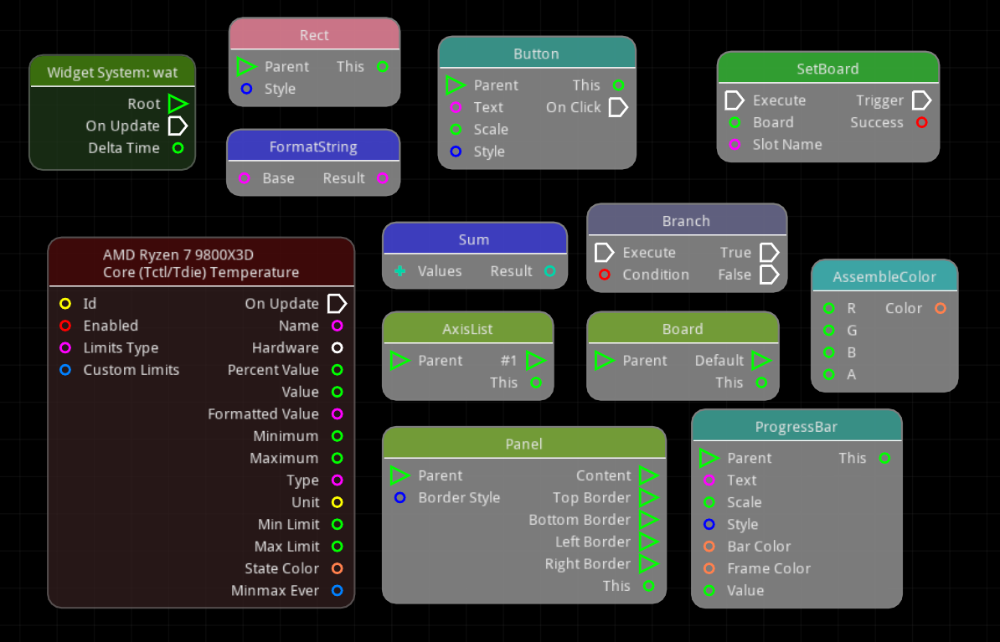
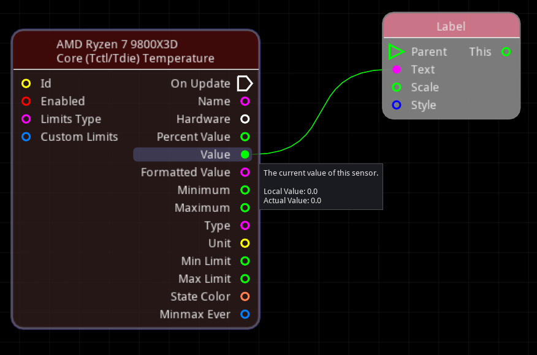
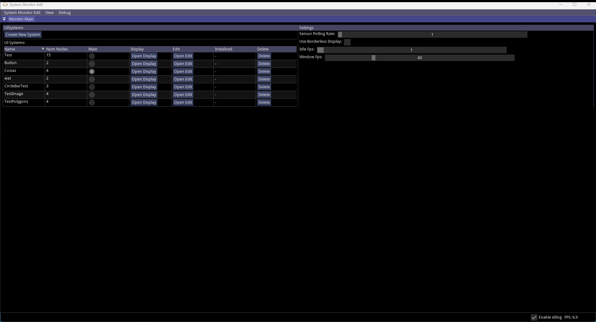
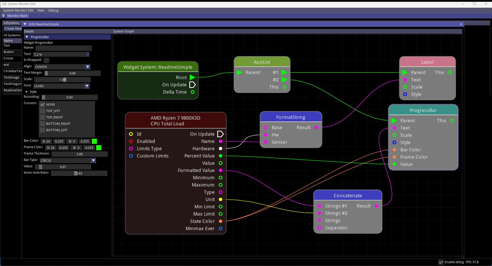
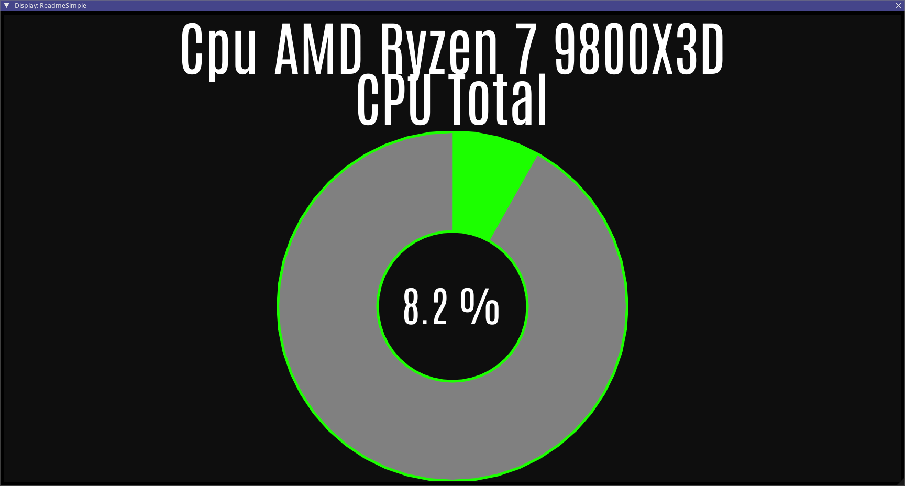
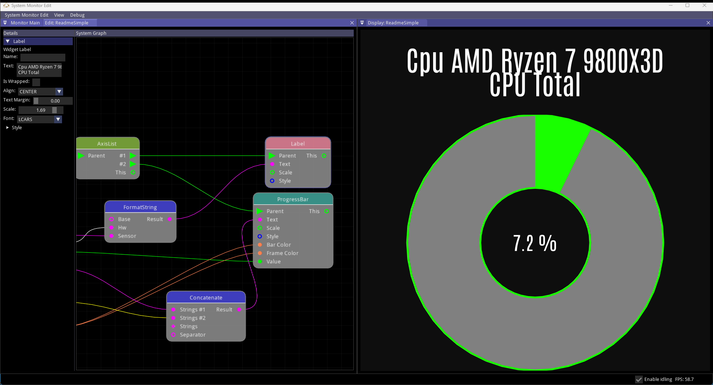
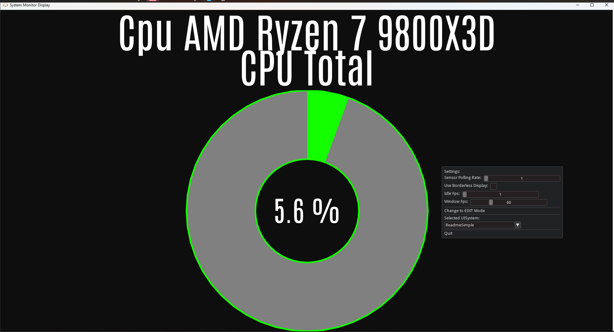

# LCARS Monitor
Python/IMGUI App to monitor hardware sensors with a customizable LCARS-themed interface.

> TODO: imagem de full lcars UISystem

## Features:
* **UISystem**: a customizable graph-based GUI system integrating Widgets (UI elements), Actions (logic nodes) and Sensors (data sources).
* Different modes for the GUI:
    * **EDIT** Mode: Main GUI to create/see/edit/select/delete UISystems (more on this below), as well as change app settings and more.
    * **DISPLAY** Mode: borderless-fullscreen GUI to display a single UISystem to the user, so you can use the system you've defined while doing something else (like gaming).
* App settings, configured UISystems and other persisted data are saved to a binary file located in the user's HOME directory.

### UI System
The **UISystem** is the customizable graph-based GUI system at the core of LCARS Monitor.

The user creates its graph (a *system*) by connecting Nodes and setting up their properties. Currently there are 3 main node types:
* **Widgets**: are the building blocks of the UI and user-interaction. From simple widgets such as Labels and Buttons, to complex widgets containing other widgets
such as Lists and Canvases; the widgets allow the user to create an hierarchy of UI elements to create the visuals and interactions of its monitor.
    * Several widgets use a *VisualStyle* object that defines the colors in different states that a widget can use. By altering these styles, you can change the overall theme
    of your widgets, and thus, of your UI as a whole.
    * By default there are specific styles and widgets for the Star Trek LCARS-theme.
* **Actions**: are nodes that can perform any kind of logic for your UI. From simple math operations that simply receive and output data to more complex nodes that do
something (like changing a Widget's property) after an event (such as a Button click).
* **Sensors**: are nodes that poll the HW Sensors source (see below) to provide sensor data for your UI.

Even with a limited amount of available nodes to use, the user can create complex UIs to define its desired HW monitor by adding nodes, setting their properties
and linking input/output values between the nodes.

Each node can have its own properties that can be configured by you. Some of these properties are also accessible as "Input Pins" in the node itself, which allows
you to link that property to a "Output Pin" of another node that provides data of a compatible type.

In the simple example above, we're setting a Label's text value to be the value from a Sensor. The label's `text` property accepts text (strings), which can be
basically anything, so it accepts the numeric value from the Sensor's `value` output. That label will display the sensor's value and update automatically as
the sensor's value changes. The sensor in the example is the CPU's Core Temperature sensor. However that can also be easily changed via the sensor's `id` property.

### Monitor EDIT Mode
The Monitor's EDIT Mode is its main mode of usage. Where the user can create or change its **UISystem**s, alter app settings, and more.

When creating or updating a **UISystem**, the user can open that system's **Edit** or **Display** windows. These windows display, respectively:
the graph-editor to configure the **UISystem** in question and the display of the **UISystem** when executed.

The Edit or Display windows of **UISystem**s can be opened or closed at will by the user, and they work as dettachable windows that can be freely
organized, resized, docked or moved around in the Monitor's Main window. They can even be dettached and placed outside the Main window, possibly
on different screens of your PC.

To close any system window, you can press the `X` button (at the right side of the window's title), or press `CTRL+Q`.
Pressing `CTRL+Q` at the Main window, or pressing `CTRL+SHIFT+Q` in any window will close LCARSMonitor itself.

See the [How to Use](#how-to-use) section on ways to change between modes.

### Monitor DISPLAY Mode
Besides the EDIT Mode, this app also has a "Display Mode", which simply displays a selected "main" **UISystem** in a single window.
This window can be maximized, or configured to be borderless-fullscreen, and so on. So the user can check and interact directly with this system.

Besides the own interactions of the **UISystem**, the user can right-click anywhere in the window to open the Display's context-menu, which
allows you to change which system is being displayed, change settings, and more.

Pressing `CTRL+Q` will close the LCARSMonitor.

See the [How to Use](#how-to-use) section on ways to change between modes.

### Hardware Sensors Data
LCARSMonitor uses [LibreHardwareMonitor](https://github.com/LibreHardwareMonitor/LibreHardwareMonitor) in order to read hardware sensor status.
This is included as a DLL in the LCARSMonitor package.

### Next Steps/Milestones:
* Update to support newer `imgui-bundle` (has breaking changes from Dear IMGUI, mainly with fonts).
* Support loading third-party nodes for the UISystem from other python packages.
* Support other Hardware Sensor data sources (such as HWiNFO or others)
* Support OpenRGB
* Support FanControl

## How To Install
* As a standalone executable:
    * We build LCARS Monitor to a single executable app for ease of use: just double-clicking it will open.
    * The executable is fully packaged and should require no other dependencies to run.
    * When running it extracts its files to a temporary directory. These are deleted when the app is closed.
* As a Python Package/Tool:
    * Download this repository and `pip install .` as usual.
    * or `pip install lcarsmonitor` to download and install the package from PyPI (WIP!)
    * *This is indicated for developers working on this package or more advanced users*

## How to Use
Execute the lcarsmonitor app, which depends on how it was installed:
* From standalone executable: just run the `lcarsmonitor.exe`.
* From Python package: open a terminal and execute the command `lcarsmonitor`.

LCARS Monitor has the following possible command-line arguments:
* `open`: opens the LCARS Monitor in the Display Mode.
    * `--system-name` (`-s`): forces the window to display the **UISystem** with this name, instead of the configured "main" system.
* `edit`: opens the LCARS Monitor in the EDIT Mode.
* `run`: opens the LCARS Monitor in the last mode used, defaulting to EDIT mode if it is the first execution.

All options also support a `--test`(`-t`) flag, which if true will restrict the available sensors to only the Dummy testing HW sensors.

When running the executable or command without arguments, the app defaults to execute the `lcarsmonitor run` command.
Regardless of command used to open the app, the user can still change the mode while running.

### Changing between Modes
There are a few ways you can change the current mode of the LCARSMonitor while it is running:
* If in EDIT Mode: at the top-menu `System Monitor Edit`, select `Change to DISPLAY Mode`.
* If in Display Mode: right-click anywhere in the window to bring the context-menu, and select `Change to EDIT Mode`.
* Regardless of current mode, with the LCARMonitor window focused, pressing `CTRL+END` will change to the other mode.

### Requirements to Run
LCARSMonitor requires elevated privileges (due to LibreHardwareMonitor) to be able to properly read status from all hardware sensors in your PC.

The standalone executable app should by default ask the user for it through UAC. However if you're running LCARSMonitor from a Python package, you can
open the terminal itself with elevated privileges, or create a shortcut that opens `lcarsmonitor` and setup the shortcut to request elevated privileges.

### Saved Data
LCARSMonitor saves its data, such as app settings and **UISystem**s, using Python's pickle. As such, it is easy to use to save & load, but issues may
arise if the app's data structures are changed in the future. But we'll cross that bridge when the time comes.

For now, data is saved in 2 main files, both located at the user's HOME directory, regardless how LCARSMonitor was installed or executed:
* `~/lcarsmonitor_datacache`: contains general app data, such as settings.
* `~/lcarsmonitor_customcache_UIManagerData`: contains the saved **UISystem**s.

If you want to backup or reset LCARSMonitor data, you can just copy or delete these files.